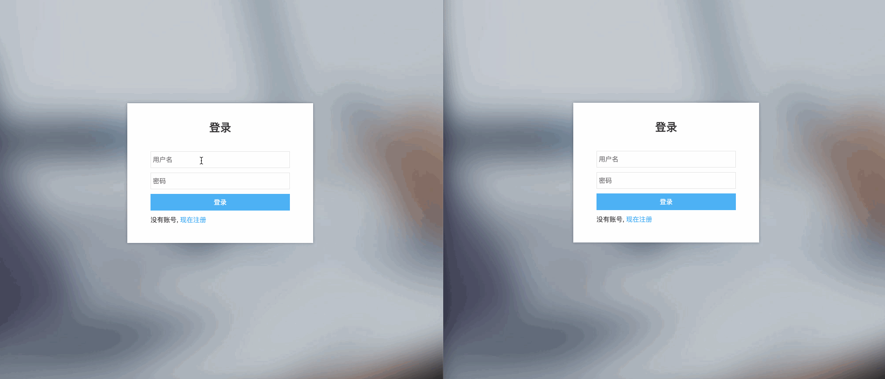

# webIM

这是一个微信 web 版的即时通讯 UI- 后台消息服务基于环信。技术基于jQuery。

# 效果

## 测试账号和地址

- demo 地址：[https://txp1035.github.io/webIM/jQuery/index.html](https://txp1035.github.io/webIM/jQuery/index.html)
- 用户名：123
- 密码：123
- 用户名：456
- 密码：456
- 建议浏览器：谷歌
